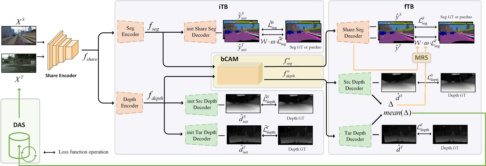
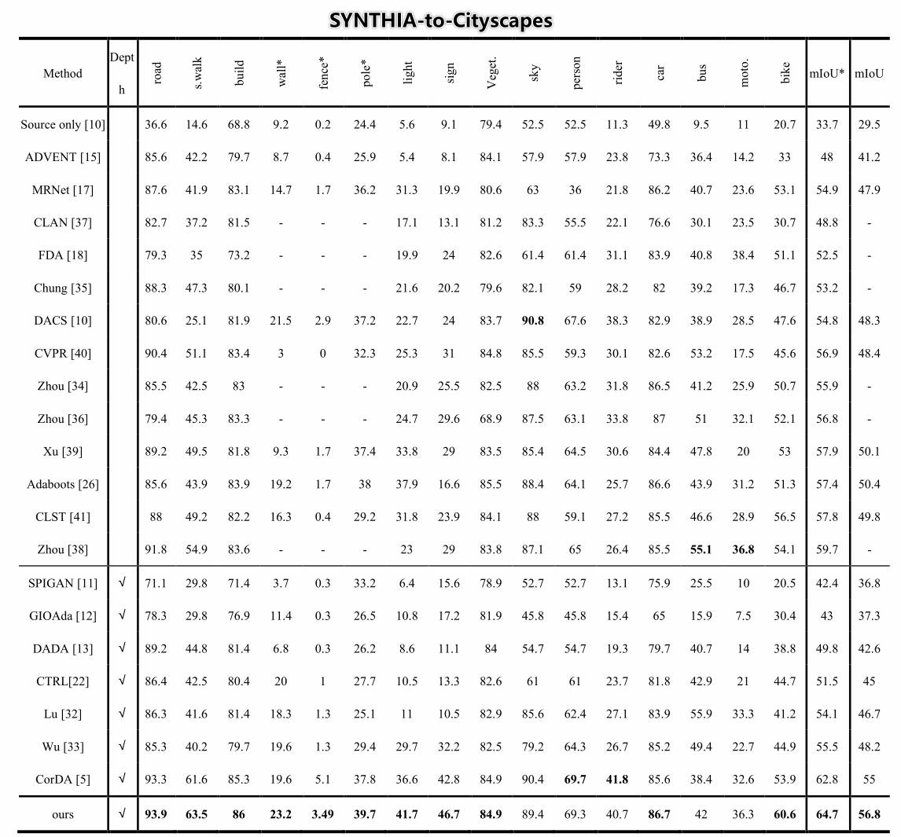
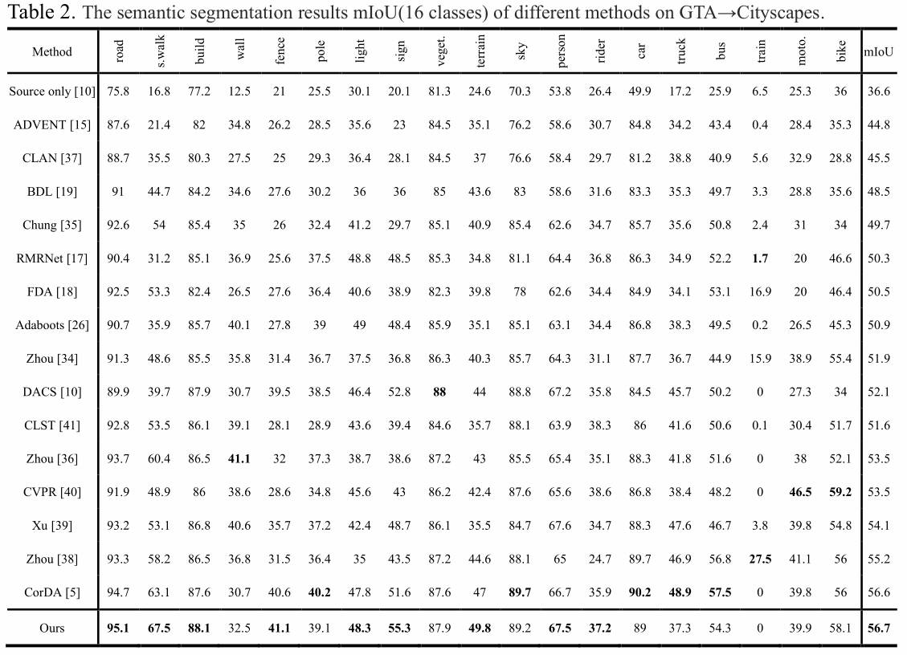

# BiCoD
Code for our paper :\
BiCoD: Bidirectional Correlated Depth Guidance for Domain Adaptation Segmentation



# 1. Installation
Please create and activate the following conda envrionment. To reproduce our results, please kindly create and use this environment.
```bash
# create environment
conda update BiCoD
conda env create -f environment.yml
conda activate BiCoD 
```
Code was tested on an NVIDIA 3090Ti with 24G Memory. 

## Our results



# 2. Datasets

* **CITYSCAPES**: Follow the instructions in [Cityscape](https://www.cityscapes-dataset.com/)
  to download the images and validation ground-truths. Please follow the dataset directory structure:
  ```html
  <CITYSCAPES_DIR>/             % Cityscapes dataset root
  ├── leftImg8bit_trainvaltest/ % input image (leftImg8bit_trainvaltest.zip)
  ├── depth/                    # From https://people.ee.ethz.ch/~csakarid/SFSU_synthetic/, also downloadable at https://www.qin.ee/depth/
  ├── disparity/                % stereo depth (disparity_trainvaltest.zip)
  └── gtFine_trainvaltest/      % semantic segmentation labels (gtFine_trainvaltest.zip)
  ```


* **SYNTHIA**: Follow the instructions [here](http://synthia-dataset.net/downloads/) to download the images from the *SYNTHIA-RAND-CITYSCAPES (CVPR16)* split. Download the segmentation labels from [CTRL-UDA](https://github.com/susaha/ctrl-uda/blob/main/README.md) using the link  [here](https://drive.google.com/file/d/1TA0FR-TRPibhztJI5-OFP4iBNaDDkQFa/view?usp=sharing).
  Please follow the dataset directory structure:
  ```html
  <SYNTHIA_DIR>/                % Synthia dataset root
  ├── RGB/                      % input images
  ├── GT/                       % semseg labels labels
  └── Depth/                    % depth labels
  ```

* **GTA5**: Follow the instructions [here](http://synthia-dataset.net/downloads/) to download the images from the *SYNTHIA-RAND-CITYSCAPES (CVPR16)* split. Download the segmentation labels from [CTRL-UDA](https://github.com/susaha/ctrl-uda/blob/main/README.md) using the link  [here](https://drive.google.com/file/d/1TA0FR-TRPibhztJI5-OFP4iBNaDDkQFa/view?usp=sharing).
  Please follow the dataset directory structure:
  ```html
  <GTA_DIR>/                    % Synthia dataset root
  ├── images/                   % input images
  ├── labels/                   % semseg labels labels
  └── disparity/                % Our generated monodepth 0-65535 in normalized disparity, downloadable at https://www.qin.ee/depth/
  ```

# 3.Train a BiCoD model
```bash
comming soon
```


# 4. Test a trained BiCoD model
Pre-trained models are provided ([Google Drive](https://drive.google.com/drive/folders/1wtCdEhHRw4G8GMkKFmCH7txfN5VSTLuk?usp=share_link)).


```python
# Test the model for the SYNTHIA2Cityscapes task
python3 evaluateUDA.py --full-resolution -m deeplabv2_synthia --model-path=<"model path">
# Test the model for the GTA2Cityscapes task
python3 evaluateUDA.py --full-resolution -m deeplabv2_gta --model-path=<"model path">
```


# 5. Results


Reported Results on SYNTHIA2Cityscapes (The reported results are based on 5 runs instead of the best run.)
| Method | mIoU*(13)| mIoU(16) |
| -------- | -------- | -------- |
|  CBST   | 48.9   | 42.6     |
|  FDA    | 52.5   | -        |
|  DADA   | 49.8   | 42.6     |
|  CTRL   | 51.5   | 45     |
|  BiCoD   | 62.8   | 55.0     |
|**BiCoD**| **64.4**   | **55.0**     |


## Acknowledgement 
+ This codebase depends on [CorDA](https://github.com/qinenergy/CorDA), [AdaBoost_seg](https://github.com/layumi/AdaBoost_Seg/blob/master/Toy_Example.md) and [DenseMTL](https://github.com/astra-vision/DenseMTL). Thank you for the work you've done!!!
+ DACS is used as our codebase [official](https://github.com/vikolss/DACS) 
+ SFSU as the source of stereo Cityscapes depth estimation [Official](https://people.ee.ethz.ch/~csakarid/SFSU_synthetic/) 

## Data links
Those compents are provided by [CorDA](https://github.com/qinenergy/CorDA),Thanks!
+ Download [links](https://qin.ee/depth/) 
    + Stereo Depth Estimation for Cityscapes
    + Mono Depth Estimation for GTA
    + SYNTHIA Depth and images [SYNTHIA-RAND-CITYSCAPES (CVPR16)
](http://synthia-dataset.net/downloads/)


